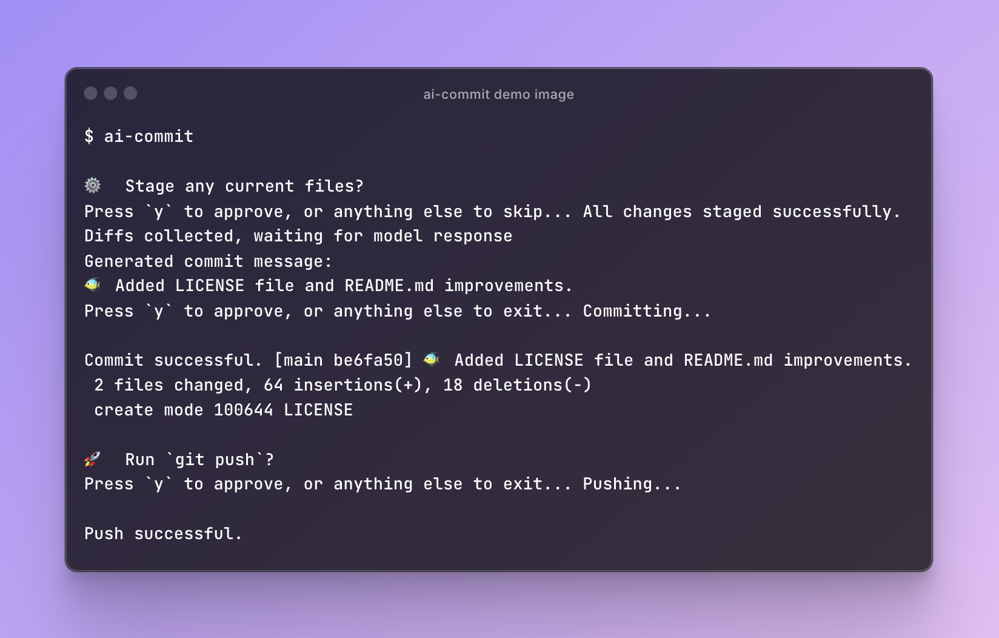

# ai-commit



<a href="https://threads.net/intent/post?text=Use%20AI%20to%20generate%20commit%20messages%20with%20this%20privacy-focused%2C%20local-first%20tool!&url=https%3A%2F%2Fgithub.com%2Fjtpotato%2Fai-commit">
   <p align="center">
      Share to Threads
   </p>
</a>

**ai-commit** is a command-line interface (CLI) tool that generates AI-assisted Git commit messages. Written in Swift based on the assumption that most Ollama users are going to have a Mac. **ai-commit** prioritizes user privacy by running all AI operations locally through Ollama. No data is sent to external servers, ensuring your commit messages and code snippets remain confidential.

## Features

- Built entirely in Swift for performance and distaste of JavaScript.
- Utilizes Ollama for generating meaningful commit messages, avoiding the need for external APIs.
- Runs entirely locally, ensuring your code and commit messages never leave your machine.
- No internet connection required for generating commit messages.
- Compatible with air-gapped development environments.

## Installation

To install **ai-commit**, you'll need to build it from source. Follow the steps below:

1. **Clone the Repository**:

   ```sh
   git clone "https://github.com/jtpotato/ai-commit" --depth=1
   cd ai-commit
   ```

2. **Run the Installation Script**:

   ```sh
   zsh install.sh
   ```

3. **Update Your PATH** (if necessary):
   If this is your first binary installation, you may need to add `~/bin` to your system's PATH:

   ```sh
   echo 'export PATH="$HOME/bin:$PATH"' >> ~/.zshrc
   source ~/.zshrc
   ```

4. **Clean Up**:
   Remove the repository after installation:
   ```sh
   cd ..
   rm -rf ./ai-commit
   ```

## Usage

After installation, you can use `ai-commit` to generate commit messages. There are no arguments, the CLI will guide you through it!

## Privacy

**ai-commit** is designed with privacy as a core principle:

- All AI operations are performed locally using Ollama.
- No data is sent to external servers or APIs.
- Your code and commit messages remain on your machine at all times.
- Suitable for use in secure, air-gapped environments.

By using **ai-commit**, you can benefit from AI-assisted commit messages without compromising the confidentiality of your projects.

As an open-source project, **ai-commit**'s codebase is fully transparent and auditable, allowing users and security experts to verify its privacy claims and security measures.

## Contributing

Contributions are welcome! Feel free to open an issue or submit a pull request if you have any improvements or new features to add.

## License

This project is licensed under the MIT License. See the [LICENSE](LICENSE) file for details.

## Acknowledgments

- Ollama for providing a local AI solution
- OllamaKit for Swift integration
- Swift Argument Parser for CLI functionality
- The open-source community for inspiring privacy-focused design

---

README mostly generated with AI.
